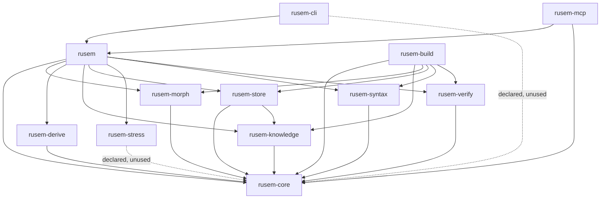

# rusem — architecture map

The Russian semantic engine. It takes a Russian phrase and answers whether the
phrase holds together, and why: it reads every word morphologically, settles on
one reading per word, parses the dependency structure, looks each content word
up in a dictionary of senses, and then runs the phrase through a battery of
gates — agreement, government, punctuation from the 1956 code, and selectional
restrictions from predicate frames. Every fact it reports carries the source it
came from.

Twelve crates, hexagonal: one domain crate owns the vocabulary and the traits,
each adapter implements one trait over one data source, one facade wires them,
two surfaces expose the facade, one offline binary builds the data.

## 1. Repository layout

| Path | What it is |
| --- | --- |
| `crates/` | The twelve workspace crates. Everything that ships. |
| `data/` | **Gitignored.** Downloaded corpora and the packs built from them. Every default path in `Settings` points here. A fresh clone has none of it and falls back to the bundled seed pack. |
| `data/packs/` | The built knowledge: `ruwiktionary.pack.jsonl` (194 MB) and its `.store` (114 MB), `valency.pack.jsonl`, `idioms.pack.jsonl`, `rules.pack.jsonl`, `advice.pack.jsonl`, plus the side tables `forms.readings`, `nouns.government`, `valency.pack.collocations`, `*.lift-rules`. |
| `data/ud/` | 316 MB of Universal Dependencies treebanks (SynTagRus, Taiga, GSD, Poetry, PUD) in CoNLL-U. Training material for the dependency parser and the valency harvester. |
| `data/conceptnet/`, `data/framebank/` | External semantic resources: ConceptNet assertions (477 MB gz) for borrowing classes through English, FrameBank tables (9.7 MB) for hand-annotated verb frames. |
| `rules/svod1956.txt` | The full text of the 1956 code of Russian orthography and punctuation, 469 KB. `rusem-build rules` parses it into `rules.pack.jsonl`. |
| `rules/svod/` | 195 directories, 357 `.rs` files — one directory per paragraph of the code, formalised as plain Rust. **Not compiled.** No crate references this tree and it is not a workspace member; it is a staging area where rules are written before being moved into `crates/rusem-verify/src/svod/`. Nine of them have made that trip so far. |
| `probes/` | The four measurement sets the gates are scored against. `rusem measure` runs all four. |
| `Cargo.toml` | Workspace: twelve members, `default-members = ["crates/rusem-cli"]`, edition 2024, MSRV 1.98. Lints deny `missing_docs`, `unsafe_code`, `unwrap_used`, `expect_used`, `panic`, `todo`. Dev profile is `opt-level = 1` with dependencies at 3. |
| `rust-toolchain.toml`, `clippy.toml`, `.rustfmt.toml` | Toolchain pin, MSRV for clippy with test-only allowances, formatting (99 columns, imports grouped by crate). |

### The probes

| File | Lines | What it holds | The number to watch |
| --- | --- | --- | --- |
| `sentences.txt` | 607 | Ordinary correct written Russian. | How few come back rejected — every refusal here is a false one. |
| `nonsense.txt` | 60 | Grammatical sentences that mean nothing: the verb and its object belong to different worlds. | How many are refused. This is the selectional-restriction gate. |
| `broken.txt` | 35 | Sentences broken at agreement, government or clause structure. Every gate added pins its own example here. | How many are refused. |
| `morphemes.txt` | 53 | Words whose composition is not in doubt, written the way a school textbook writes it. | How many the engine writes the same way. Measures the analyzer, not the gates. |

Read them together — a change that improves one at the cost of another has
bought nothing. `data/in_domain_train.csv` (7 870 sentences), `in_domain_dev.csv`
(984) and `out_of_domain_dev.csv` (1 805) are the RuCoLA acceptability corpus,
added to the same report by `rusem measure data`.

## 2. The layers

| Layer | Crates | Rule |
| --- | --- | --- |
| Domain | `rusem-core` | Types, ports (traits), `Violation`, `Verdict`. Zero internal dependencies. Everything points here. |
| Adapters | `rusem-morph`, `rusem-derive`, `rusem-stress`, `rusem-syntax` | Each implements one port over one data source. Each depends on `rusem-core` alone. |
| Knowledge | `rusem-knowledge`, `rusem-store` | Two implementations of the same four ports: in-memory packs versus a flat binary file. `rusem-store` reads `rusem-knowledge`'s `Pack` types as its input format. |
| Policy | `rusem-verify` | The checker. Generic over `<M, W, K>`; depends on `rusem-core` only and knows no concrete adapter. |
| Facade | `rusem` | The only crate that names all eight. Monomorphises the whole tower in `engine.rs`. |
| Surfaces | `rusem-cli`, `rusem-mcp` | Hold `rusem` and nothing else. |
| Offline | `rusem-build` | Converter binary, not on the runtime path. Writes everything in `data/`. |

A bare `cargo build` builds `rusem-cli` and its transitive dependencies only;
`rusem-mcp` and `rusem-build` need `-p`.

## 3. The crates

### `rusem-core`

Domain vocabulary of the Russian semantic engine: stable identifiers, grammatical categories, morphological analysis, word formation, dictionary senses, semantic relations, predicate frames, provenance tracking, checking verdicts, and trait-based ports for pluggable layers.

**Files**

| File | Role |
| --- | --- |
| `src/id.rs` | Opaque numeric identifiers (LemmaId, SenseId, MorphemeId, FrameId, SourceId) backed by NonZeroU32 with display prefixes. |
| `src/grammar.rs` | Russian grammatical categories: PartOfSpeech, Case, Number, Gender, Animacy, Aspect, Tense, Mood, Person, Transitivity, Voice; composite GrammarTag with agreement checking. |
| `src/morphology.rs` | WordForm (normalized Cyrillic), Analysis, Readings (multiple ranked analyses), Paradigm; validates the alphabet. The ё-folding every comparison uses is stated once in `src/alphabet/vowel.rs`. |
| `src/derivation.rs` | Morpheme segmentation: MorphemeKind, Segment, Segmentation (validated non-overlapping tiling with root requirement), DerivationWay, DerivationStep, DerivationChain. |
| `src/sense.rs` | Dictionary senses: SemanticClass (20 ontological types), TimeOrientation, Register (stylistic layer), Sense (definition, class, register, domain, examples), Idiom. |
| `src/relation.rs` | Semantic network links: RelationKind (20 types with inverse pairs), Relation struct; transitivity and inversion properties for graph traversal. |
| `src/frame.rs` | Predicate frames: SemanticRole, SlotForm (case/preposition/infinitive/clause), SenseFacts trait, Constraint (recursive logic for slot restrictions), Slot, Frame; evaluation without models. |
| `src/evidence.rs` | Provenance tracking: Source (id, name, title, kind, revision), Confidence (0.0-1.0 with CERTAIN/DERIVED/GUESSED), Provenance (source+locator), Evidenced<T> wrapper. |
| `src/verdict.rs` | Checking verdicts: Severity (Fatal/Doubt/Note), Violation (52 error variants from UnknownWord to MarkedReadingOnly), Remoteness, Status, Reading, Verdict with status inference. |
| `src/ports.rs` | Trait ports for pluggable layers: Morphology, Syntax, WordFormation, DerivationalNest, Lexicon, SemanticNetwork, FrameInventory, Checker; forwarding impls for Arc<T> and &T. |
| `src/syntax.rs` | Dependency tree model: Relation (14 UD-derived types), Tree struct with heads/labels; queries for governors, children, attribute descriptions, participants. |
| `src/error.rs` | Domain-specific errors: ConfidenceOutOfRange, UnusableWordForm, BrokenSegmentation, UnknownLemma/Sense/Frame/Source, AdapterFailure; uses masterror::Error. |

**Public surface**

- id::{LemmaId, SenseId, MorphemeId, FrameId, SourceId} - Opaque identifiers with stable numeric backing.
- grammar::{PartOfSpeech, Case, Number, Gender, Animacy, Aspect, Tense, Mood, Person, Transitivity, Voice, GrammarTag} - Normalized grammatical categories with agreement checking.
- morphology::{WordForm, Analysis, Reading, Readings, Paradigm} - Word forms, analyses ranked by confidence, inflections.
- derivation::{Morpheme, MorphemeKind, Segment, Segmentation, DerivationWay, DerivationStep, DerivationChain} - Morpheme structure and word formation chains.
- sense::{Sense, Idiom, SemanticClass, Register, TimeOrientation, TimeEvidence, TimePlacement} - Dictionary senses with semantic classes and stylistic marks.
- relation::{RelationKind, Relation} - Semantic network links with inverses and transitivity.
- frame::{Frame, Slot, SlotForm, SemanticRole, Constraint, SenseFacts} - Predicate frames and selectional restrictions.
- evidence::{Evidenced, Confidence, Provenance, Source, SourceKind} - Provenance and confidence tracking.
- verdict::{Verdict, Violation, Reading, Status, Severity, Remoteness, AgreementCategory} - Checking results and error verdicts.
- ports::{Morphology, Syntax, WordFormation, DerivationalNest, Lexicon, SemanticNetwork, FrameInventory, Checker} - Trait interfaces for pluggable layers.
- syntax::{Tree, Relation} - Dependency tree with UD-derived relations.
- error::{CoreError, Result} - Domain-specific error types.

**Uses inside the workspace**

- nothing — `rusem-core` is the root of the graph

**Third-party**

- masterror - Provides the Error trait for CoreError enum via #[derive(Error)]; critical for domain-level error representation.
- serde (optional) - Enables serialization/deserialization via #[derive(Serialize, Deserialize)] on all public types when feature='serde' is enabled; used for persistence and cross-layer communication.

**How it works**

WordForm input flows through Morphology port (analyze) producing Readings with multiple Analysis each paired to a LemmaId; each reading carries Evidenced wrapper stating Confidence and Provenance. The Lexicon port maps LemmaId to Senses (semantic units, not lemmas); Segmentation validates morpheme tiling invariant (ordered, gapless, complete, with root) and DerivationChain traces word formation steps backward to an underived base. SemanticNetwork relates senses via 20 RelationKind types (each with computed inverse); Frame describes a sense's predicate government through Slots, each with SlotForm (case/preposition/infinitive/clause) and Constraint (recursive logic: Any/OfClass/KindOf/OfAnimacy/All/Either/Not) evaluated against SenseFacts without models. Syntax port returns Tree (dependency structure with UD Relation labels) pairing heads and labels. Checker trait orchestrates the ports into Verdict: a list of readings (senses chosen for content words + frame sense) and Violations (52 domain-specific error types from unknown words to semantic mismatches). Every fact carries Evidenced wrapper: the value, where it came from (Provenance: source + locator), and how strongly supported (Confidence: CERTAIN 1.0, DERIVED 0.6, GUESSED 0.3, or custom 0.0-1.0).

**Sharp edges**

- Segmentation invariant enforced at construction: segments must be ordered, non-overlapping, complete coverage of form, and contain at least one Root. Deserialization via serde re-checks the invariant.
- Confidence is a closed unit-interval scale (0.0-1.0), not a probability; deserialization rejects out-of-range values.
- Relation kinds are bidirectional: Hypernym ↔ Hyponym, PartOf ↔ HasPart, etc. Inverse is idempotent and total.
- Only Hypernym, Hyponym, PartOf, HasPart relations are transitive; instance-of is membership, not inclusion, and does not chain in either direction.
- Constraint evaluation distinguished two modes: holds_for (affirmative, climbs taxonomy) vs condemns (for negation, uses only direct class, no ancestors).
- GrammarTag agreement checks only stated categories; absent categories do not clash (unknown case = no constraint).
- Violations#severity() returns Fatal for 44 variants, Doubt for 5 (UnlistedWord, OccasionalWord, MissingDash), Note for 3 (UnsupportedClaim, AdvisedAgainst, MarkedReadingOnly).
- Remoteness determines Severity::Doubt for Marked, Severity::Note for Figurative and Late.
- All port traits are object-safe and support forwarding to Arc<T> and &T for flexible ownership.
- WordForm normalizes case and typographic dashes/apostrophes; rejects non-Cyrillic and whitespace.
- Paradigm and Analysis are independent; paradigm states forms, analysis states one reading of a form.

### `rusem-morph`

Morphological analysis and inflection for Russian, backed by OpenCorpora dictionary via rsmorphy.

**Files**

| File | Role |
| --- | --- |
| `src/lib.rs` | Public API surface; re-exports OpenCorporaMorphology and public modules |
| `src/analyzer.rs` | Main adapter implementing Morphology trait; wraps rsmorphy MorphAnalyzer and guards against panics |
| `src/tagset.rs` | Bidirectional translation between OpenCorpora tag format and rusem-core grammar categories |
| `src/speech.rs` | Disambiguates part of speech by identifying unambiguous readings and agreement with neighbors |
| `src/declension.rs` | Determines noun declension pattern (1st/2nd/3rd/indeclinable) and stem shape (hard/soft) |
| `src/declension/endings.rs` | Lookup tables for noun endings by declension, stem, gender, and number |
| `src/declension/spelling.rs` | Applies Russian phonological rules (ы→и after velars, о→е after sibilants) and manages fluent vowels |
| `src/declension/reading.rs` | Parses written noun forms back to case/number cells they could come from |
| `src/declension/attributive.rs` | Lookup tables for adjectival endings by stem shape, gender, and number |
| `src/declension/agreed.rs` | Parses written adjectives/agreeing words back to case/number/gender cells |

**Public surface**

- OpenCorporaMorphology - Morphology adapter backed by OpenCorpora, with open(path, source_id) and bundled(source_id) constructors
- OpenCorporaMorphology::descriptor() - Returns Source metadata for registration in a store
- Morphology trait impl: analyze(WordForm) → Readings, inflect(WordForm, GrammarTag) → Vec<WordForm>, paradigm(WordForm) → Paradigm
- declension module - Determines Declension and Stem from nominative form and gender; provides of() and stem()
- speech::Settled - Disambiguated word with form, reading index, and settled part of speech or None if open
- speech::settle(Readings[]) - Disambiguates all words by agreement with neighbors
- tagset::read(OpencorporaTagReg) - Converts OpenCorpora tag to GrammarTag
- tagset::write(GrammarTag) - Converts GrammarTag to comma-separated grammeme string for inflection

**Uses inside the workspace**

- rusem-core - Exports WordForm, Readings, Analysis, Paradigm, Reading, Evidenced; defines Morphology trait and error types

**Third-party**

- rsmorphy 0.4 - Russian morphological analyzer; used for parse(), lexeme analysis, inflection, and paradigm iteration via MorphAnalyzer
- rsmorphy-dict-ru 0.1 (optional, bundled-dict feature) - Provides DICT_PATH to bundled OpenCorpora dictionary; loaded via rsmorphy_dict_ru::DICT_PATH

**How it works**

OpenCorporaMorphology wraps rsmorphy's MorphAnalyzer and translates between OpenCorpora and rusem-core semantics. analyze() parses a form via rsmorphy.parse(), converting each lexeme's tag via tagset::read() into Readings with confidence based on whether it was known or guessed. inflect() looks up the form in rsmorphy, builds a GrammemeSet from tagset::write() applied to the requested GrammarTag, then filters inflected forms. paradigm() finds the best-scoring lexeme for a form and iterates its paradigm via lex.iter_lexeme(), collecting all forms with their tags. Panics in rsmorphy's guessing code are caught via hush() once at startup, silenced for that guesser but printed if they come from elsewhere. speech::settle() disambiguates part of speech by first collecting unambiguous readings (all readings name the same part), then iteratively settling open words via agreement: a reading survives only if some settled neighbor agrees with it on case/number/gender. The declension module provides utilities for analyzing noun morphology independently: of() and stem() read the dictionary form and gender to determine declension pattern and stem shape, then reading::cells() maps written forms to potential case/number combinations, and attributive and agreed modules do the same for adjectives.

**Sharp edges**

- rsmorphy panics on some unusual forms in guessing paths; caught and converted to CoreError via guarded() wrapper around panic::catch_unwind
- Accusative case handling is asymmetric: nominative declension states no accusative (repeats nominative for inanimate, genitive for animate); adjectival declension states feminine accusative but not masculine/neuter
- Stress is unknown when reading forms, so spelling::fitted() is called with both stressed=true and false to admit both possibilities
- OpenCorpora distinguishes loc1/loc2, gen1/gen2, acc2; read_case() merges them into domain cases (Prepositional ← loc1, Locative ← loc2, Genitive ← gen1/gen2, Accusative ← accs/acc2)
- tagset::write() outputs only stated categories; a silent category leaves the analyzer free to choose
- declension module is standalone and used only by declension submodules and tests; not called by analyzer.rs

### `rusem-derive`

Russian word formation layer: morpheme segmentation and word motivation (finding the base word).

**Files**

| File | Role |
| --- | --- |
| `src/lib.rs` | Public API: exports RuleSegmenter, Splits, and affix module |
| `src/affix.rs` | Affix tables (PREFIXES, SUFFIXES, ENDINGS, VERBAL_SUFFIXES, POSTFIXES, INTERFIXES) and morpheme utilities: vowel/consonant checks, longest-match lookup |
| `src/segmenter.rs` | RuleSegmenter<M>: implements WordFormation trait with segment() and motivation() methods; cuts words by affix tables; finds derivation bases |
| `src/table.rs` | Splits: loads and queries manually-segmented morpheme splits from file format (word<TAB>morphs); validates consistency |

**Public surface**

- RuleSegmenter<M>: segmenter struct over Morphology; methods: new(), with_morphemes(), with_lexicon(), descriptor(), table_descriptor()
- Splits: table of manual morpheme splits; methods: read(), of(), len(), is_empty()
- affix module: PREFIXES, SUFFIXES, ENDINGS, VERBAL_SUFFIXES, POSTFIXES, INTERFIXES constants; has_vowel(), is_vowel(), leading(), trailing() functions

**Uses inside the workspace**

- rusem-core: provides WordFormation trait implementation interface; Morphology, Lexicon ports for dictionary/morphology access; types WordForm, Morpheme, MorphemeKind, Segmentation, DerivationChain, DerivationStep, DerivationWay, Segment, Confidence, Evidenced, Provenance, Source, SourceKind, SourceId, PartOfSpeech; error Result and CoreError

**Third-party**

- std library only (collections::HashMap, io::BufRead for Splits file parsing)

**How it works**

RuleSegmenter wraps a Morphology port (for form analysis/paradigms) and optional Lexicon (word senses) and Splits table (manual overrides). On segment(), it first checks Splits table; if missing, generates hypotheses by exhaustively trying ending lengths and combinations of affix table cuts (longest prefix first), scoring each by known-root status and paradigm fit. On motivation(), it walks back through derivation chains by removing affixes one step at a time, checking each intermediate against the dictionary to validate the base word. Affixes are matched greedily (longest first) using affix constants; vowel-only roots and short affixes are penalized to avoid false cuts. Both Morphology (to validate form/root existence) and Lexicon (to check semantic definitions) are consulted as evidence sources.

**Sharp edges**

- Splits table lookup is case-insensitive (lowercase key); manual splits override rules entirely and return confidence CERTAIN
- Minimum root length is 3 characters; one-character affixes require known root or word-form existence from morphology
- Affix tables are longest-first (greedy); prefix/suffix order matters: suffixes stripped before prefixes during segmentation
- Verbal-suffix set prevents noun cutting: ль+щик, ыва, ива, ова, ева, л, ну removed only from verbs
- Derivation chain walks only up to 5 steps; halts on loop detection (base == earlier step 'from')
- Paradigm-based ending detection requires 75% of forms to share a common prefix to count as 'stable'
- Two hypotheses max returned per segment call (ranked by score); same cuts deduplicated before return

### `rusem-stress`

Place stress marks on Russian text using a table of spelling → stress position mappings and morphological readings to resolve homographs.

**Files**

| File | Role |
| --- | --- |
| `src/lib.rs` | Module root; re-exports public API (Placement, Table, Marked, Reading, place, place_word, needs_mark) |
| `src/table.rs` | Stores spelling → placement(s) mapping; parses tab-delimited format (spelling TAB lemma:vowel:tags:article ...); fault-tolerant parsing; provides lookup and homograph detection |
| `src/text.rs` | Places acute accent marks on words in running text; segments by non-alphabetic chars; calls place_word() for each; resolves homographs via lemma/tags matching or chief article fallback |

**Public surface**

- Placement — struct: lemma, vowel position (usize), tags (Vec<String>), article index
- Table — struct: get(spelling) → &[Placement], is_homograph(spelling) → bool, len/is_empty, read(BufRead), from_parts(HashMap)
- Reading — struct: lemma (String), tags (Vec<String>); input from morphological analyzer
- Marked — struct: written (String with mark or bare), placed (bool), homograph (bool)
- place(table, text, readings) → String — stress-marked text; readings slice aligns with words
- place_word(table, word, reading) → Marked — marks single word or returns it bare
- needs_mark(word) → bool — false if 1 syllable or contains ё

**Uses inside the workspace**

- nothing — `rusem-core` is the root of the graph

**Third-party**

- rusem-core (workspace) — listed in Cargo.toml but not used anywhere in src code; no imports, no function calls

**How it works**

Table::read() parses stress placement data into HashMap<spelling, Vec<Placement>>; spellings stored lowercased. place() iterates text chars, accumulates alphabetic/hyphen into words, splits on other chars, and flushes words to place_word(). place_word() checks needs_mark() (excludes 1-syllable and ё words), gets Placement list from table. Single placement used directly. Multiple placements: settle() tries to match by reading's lemma and tags, then chief() falls back to first article (0). If neither resolves, returns None. marked() inserts combining acute (U+0301) at vowel offset. Result wrapped in Marked with placed/homograph flags. Text reconstruction preserves non-alphabetic chars and spacing."

**Sharp edges**

- Table parsing is fault-tolerant: malformed lines silently skipped (continue), not errors; only line structure checked (tab, colon separators)
- Hyphen (-) treated as alphabetic for word boundaries; included in word accumulation
- Stress mark is combining diacritical U+0301 (COMBINING ACUTE ACCENT), not precomposed; inserted after the selected vowel char
- Homographs without resolving reading are left unmarked to avoid mispronunciation; wrong stress worse than none
- Vowel count uses Cyrillic vowels only (а е ё и о у ы э ю я); syllable count = vowel count
- Article index defaults to 0 if missing or unparseable; used to prefer first dictionary entry
- Reading tags must ALL match placement tags for settle() to confirm (line 162: all() on reading.tags against placed.tags)
- rusem-core dependency is unused; code has no imports or references to it despite it being pulled in transitively

### `rusem-syntax`

Greedy transition-based dependency parser for Russian using a linear model over feature-hashed weights.

**Files**

| File | Role |
| --- | --- |
| `src/lib.rs` | Entry point; re-exports rusem_core::syntax as tree and publicly exports parser, token, train modules. |
| `src/parser.rs` | Core parser: Action enum (Shift/Left/Right), Model (linear weights indexed by hash), State (stack/queue/tree tracking), features extraction, and greedy parse() function. |
| `src/token.rs` | Token struct wrapping form/lemma/tag with encoding methods that convert POS, case, number, gender to short strings for feature hashing. |
| `src/train.rs` | Perceptron training: learn() function with shuffled epochs, static oracle, weight averaging, and measure() for UAS/LAS evaluation. |

**Public surface**

- Parser - main type implementing rusem_core::ports::Syntax trait; wraps Model
- Parser::from_bytes() - load model weights from file
- Parser::parse() - Syntax trait impl converting forms+analyses to dependency tree
- Model - f32 weight vector sized ACTIONS*BUCKETS
- Model::new() - initialize zero weights
- Model::from_weights() - load from pre-sized vector
- Model::score() - sum weights for action+features
- Model::choose() - select best allowed action
- Model::nudge() - adjust weights by step
- Action - enum Shift | Left(Relation) | Right(Relation)
- Action::index() - encode to weight table position
- Action::at() - decode from position
- State - parser configuration (stack, next index, partial tree)
- State::start() - initial state for sentence
- State::allowed() - which actions are legal
- State::take() - apply action and update state
- Token - form/lemma/tag triplet with POS/case/shape accessors
- parse() - core greedy parsing function
- features() - extract and hash features from State+tokens
- learn() - train model from Annotated sentences
- measure() - evaluate UAS/LAS accuracy
- Training - epochs/step/seed configuration
- Annotated - tokens+gold tree pair
- Progress - decisions/correct counts with accuracy() method
- BUCKETS (262144) - feature hash table size
- ACTIONS - 1 + 2*Relation::ALL.len()

**Uses inside the workspace**

- rusem_core::syntax::{Tree, Relation} - dependency tree representation with heads/labels arrays and children_of/head_of/label_of methods
- rusem_core::grammar::{GrammarTag, PartOfSpeech, Case, Number, Gender} - morphological tag types
- rusem_core::morphology::{WordForm, Analysis} - input types from prior morphological stage
- rusem_core::ports::Syntax - trait interface for parsers
- rusem_core::error::Result - error type

**Third-party**

- serde (optional, via workspace) - unused in code; likely for future serialization of Model or configuration

**How it works**

Parser::parse() (Syntax trait) converts word forms and morphological analyses into Token objects, then calls parse(model, tokens). The parse() function initializes State with an empty stack, next index 0, and a loose Tree of sentence length. For up to 2n+4 iterations, it extracts features from the current state (POS, cases, shapes, word forms, lemmas of stack and queue positions) and hashes each feature string into a bucket index (0..262144). The model scores each allowed action by summing weights at (action_index*BUCKETS + feature_bucket) positions. Allowed actions depend on state: Shift if words remain, Left/Right(non-Root) if stack has 2+ words. The parser greedily selects the highest-scoring allowed action and applies it: Shift pushes next word to stack, Left/Right attaches top word to second-top under a relation and pops it. When done (queue empty, stack size ≤1), any remaining stack words are attached to root with Relation::Other. Training via learn() runs perceptron over epochs with shuffled sentence order: for each Annotated sentence, an oracle determines the correct action at each step (join top 2 stack words if head-dependent in gold tree and dependent is settled, else shift), the model's choice is compared, and weights are nudged ±step for mismatch. After all epochs, weights are replaced with averaged values across all updates, stored as running totals and timestamps. measure() evaluates by parsing each sentence and comparing UAS (heads) and LAS (heads+labels) against gold trees.

**Sharp edges**

- no_std with alloc - uses Vec/String but not std library.
- Greedy parsing - takes best action immediately, no backtracking or beam search.
- Static oracle only - correct action determined by gold tree structure alone.
- Features hashed to fixed 262144 buckets - collisions degrade accuracy but acceptable; no vocabulary.
- Weights averaged at end not final values - crucial for perceptron: averaged remembers all sentences, final value only last.
- Action encoding: index 0=Shift, 1..(1+N)=Left(relations), (1+N)..(1+2N)=Right(relations).
- Shape feature encodes 12 combinations: (singular|plural|unknown) × (masculine|feminine|neuter|unknown).
- Feature values capped: gap distance at 9, child count at 5, cases taken at 4.
- Shuffle uses XOR-based LCG from seed - reproducible, not cryptographic.
- Parser deterministic given model and features.

### `rusem-knowledge`

Implements the knowledge base of the Russian semantic engine: the JSON authoring format for packs, the loaded index that resolves references and assigns identifiers, and trait implementations to expose this data to engine layers.

**Files**

| File | Role |
| --- | --- |
| `src/lib.rs` | Crate interface; re-exports pack, index, error, ports modules; embeds SEED.json and VALENCY.jsonl constants |
| `src/error.rs` | PackError enum with 8 variants (Malformed, UnusableHeadword, HeadwordDefinedTwice, EntryWithoutSenses, DanglingReference, UnreadableReference, IdiomOverUnknownHeadword, IndexOverflow) and conversion to CoreError |
| `src/pack.rs` | JSON authoring format: Pack, Entry, SenseRecord, SenseRef, FrameAttachment, IdiomRecord, FrameRecord, SlotRecord, ConstraintRecord with from_json/read_lines/to_json methods |
| `src/index.rs` | Knowledge struct with load() that declares headwords, assigns identifiers (LemmaId/SenseId), resolves references, creates bidirectional relations, attaches frames; query methods: sense_id, lemma_id, label, headword, find_sense, sense_ids, relations, frames, idioms, ascends_to, ascends_nearby, shortest_path, classes_over |
| `src/ports.rs` | Trait implementations for Knowledge: Lexicon (lemmas_of, senses_of, sense, idioms_with, sources), SemanticNetwork (relations_of, is_kind_of, path_between), FrameInventory (frames_of), SenseFacts (classes_above, class_of, is_kind_of, animacy_of, orientation_of) |

**Public surface**

- Pack::from_json/read_lines/to_json - Parse and write pack format
- Knowledge::load - Load packs into index
- Knowledge::sense_id - Resolve headword+number to SenseId
- Knowledge::lemma_id - Get LemmaId from WordForm
- Knowledge::find_sense - Get Sense with provenance
- Knowledge::sense_ids - Get all senses of a headword
- Knowledge::relations - Get edges a sense takes part in
- Knowledge::frames - Get government patterns of a sense
- Knowledge::idioms - Get set expressions a headword takes part in
- Knowledge::ascends_to - Check taxonomic containment (6-step walk)
- Knowledge::ascends_nearby - Check containment within slot reach (3-step walk)
- Knowledge::shortest_path - Find path between two senses
- Knowledge::classes_over - Collect semantic classes up the taxonomy
- Lexicon trait - lemmas_of, senses_of, sense, idioms_with, sources
- SemanticNetwork trait - relations_of, is_kind_of, path_between
- FrameInventory trait - frames_of
- SenseFacts trait - classes_above, class_of, is_kind_of, animacy_of, orientation_of

**Uses inside the workspace**

- rusem-core (serde feature): SenseId/LemmaId/SourceId/FrameId identifiers; WordForm headword parsing; Sense/Relation/Frame/Idiom/Constraint core types; Evidenced/Provenance/Source evidence; port traits Lexicon/SemanticNetwork/FrameInventory/SenseFacts

**Third-party**

- serde (std feature): Serialize/Deserialize derives on Pack, Entry, SenseRecord, etc. for JSON marshalling
- serde_json: JSON parsing in Pack::from_json and read_lines, JSON writing in to_json, used in pack tests
- masterror (std feature): Error trait derivation for PackError enum to provide Display and Error implementations

**How it works**

Packs are authored as JSON documents or JSONL streams with headwords, definitions, relations, frames, idioms written by lexicographers. Knowledge::load() validates each pack in order: declares headwords (parsing them as WordForm, rejecting duplicates and unparseable ones), assigns sequential identifiers to headwords and their senses. Then it walks the senses again, resolving references like "жидкость#1" to SenseId by parsing the headword and looking up the sense number; relations are added bidirectionally and frames are built. Idioms are registered by their constituent headwords. The resulting Knowledge index is queried through four port trait implementations: Lexicon answers questions about word forms, senses and idioms; SemanticNetwork traverses the taxonomy (with three climb bounds: MAX_ASCENT=6 for facts, CLASS_ASCENT=1 for ontological classes, CONSTRAINT_ASCENT=3 for slot restrictions); FrameInventory lists government patterns; SenseFacts answers quick facts about a single sense.

**Sharp edges**

- Headwords must be valid Russian word forms per rusem_core::morphology; parse failure during load is a PackError
- Duplicate headwords across packs are refused (sense numbering would be ambiguous for cross-references)
- Dangling references cause load failure; a reference must point to a sense defined in one of the loaded packs
- Relations in packs are one-directional text; the index automatically adds inverses so the graph is traversable both ways
- Frame attachments (non-own packs) with missing senses silently skip rather than error; allows frame tables for partial dictionaries
- Three distinct climb bounds control taxonomy traversal: MAX_ASCENT=6 for full ascendance checks, CLASS_ASCENT=1 for class collection (upper floors are too noisy), CONSTRAINT_ASCENT=3 for slot restrictions (real genus chains are 3 steps, longer chains cross into different semantic worlds)
- SenseRef parsing requires format 'headword#number' where number >= 1; zero or missing number is rejected
- Pack loading is all-or-nothing: one error anywhere halts the entire load; no partial acceptance

### `rusem-store`

On-disk knowledge base for the Russian semantic engine, converting memory-intensive JSON packs into flat binary records for efficient startup and minimal allocation.

**Files**

| File | Role |
| --- | --- |
| `src/lib.rs` | Module coordination and public API re-exports |
| `src/error.rs` | StoreError enum and Result type alias for build/read failures |
| `src/layout.rs` | Binary file layout constants and little-endian byte I/O helpers |
| `src/vocabulary.rs` | Bijective mapping of semantic enums (PartOfSpeech, SemanticClass, etc.) to u8 indices, with JSON serialization |
| `src/read.rs` | Store struct that reads and queries the binary file: bisection lookup, graph traversal, sense reconstruction |
| `src/write.rs` | Two-pass pack→store converter: outline headwords and sense counts, then fill binary records with resolved references |
| `src/ports.rs` | Base struct wrapping Store with loaded frames, implementing Lexicon, SemanticNetwork, FrameInventory, SenseFacts traits |

**Public surface**

- build(first: BufRead, second: BufRead) → Result<Vec<u8>> — converts pack to binary store format in two passes
- Store — on-disk knowledge base providing lemma lookup, sense queries, relation traversal, and taxonomy climbing
- Base — wraps Store with frame packs, implements core interfaces for the engine
- StoreError — error variants for file I/O, format validation, layout mismatch, truncation, malformed input, unusable headwords, overflow
- Result<T> — type alias for Result<T, StoreError>

**Uses inside the workspace**

- rusem-core: Core type definitions — Sense, Relation, Frame, SenseId, LemmaId, Source, Provenance, Confidence, WordForm morphology, SemanticClass, PartOfSpeech, Register, RelationKind, Animacy, Idiom, Constraint, SlotForm, and trait interfaces (Lexicon, SemanticNetwork, FrameInventory, SenseFacts)
- rusem-knowledge: Pack structures — Pack, Entry, SourceRecord, SenseRef, ConstraintRecord, SlotRecord for reading source data

**Third-party**

- masterror (std feature) — derives Error trait on StoreError and propagates errors with to_string()
- serde (std feature) — serializes/deserializes Names vocabulary tables as JSON
- serde_json — parses JSON for Names tables, SourceRecord, and error messages

**How it works**

write.rs:build() receives two BufRead instances of the same pack. The first pass (outline) scans for Source metadata and Entry records, sorting headwords and numbering senses by entry position and offset — this produces a deterministic Outline. The second pass (fill) walks Entry records again and writes fixed-width binary sense records, resolving SenseRef pointers against the Outline and building bidirectional edges (forward at 1000 confidence, reverse at 600). A Vocabulary collects all enum values (PartOfSpeech, SemanticClass, etc.) and maps them to u8 indices, serializing the mappings as JSON at the file end. All sections (entries, senses, relations, examples, text blob) are assembled behind a header stating their offsets. read.rs:Store::open() validates the magic bytes and version, reads the entire file into a buffer, and extracts the vocabulary table. Queries bisect the entry table to find headwords, reconstruct Sense values on demand from fixed-width records, and traverse relations via BFS (with three different climb bounds: MAX_ASCENT=6 for full taxonomy, CLASS_ASCENT=1 for class collection, CONSTRAINT_ASCENT=3 for slot restrictions). ports.rs:Base wraps a Store and loads frame packs, resolving frame references and idioms against the store's sense identifiers while dropping dangling pointers. It implements engine interfaces by delegating dictionary queries to Store and holding frames+idioms in memory.

**Sharp edges**

- Relations are bidirectional — write.rs creates both forward and reverse edges, with reverse at lower confidence (600 vs 1000)
- Dangling references silently dropped — both in build() when resolving pack references to undefined senses, and in Base::new() when loading frames pointing to missing senses
- Three taxonomy climb bounds tuned for different use cases: MAX_ASCENT=6 for semantic checks (full connected graph), CLASS_ASCENT=1 for class collecting (stops before upper ontological blur), CONSTRAINT_ASCENT=3 for slot restrictions (covers real genus chains without noise)
- Little-endian byte order throughout; magic header RUSEMBS1 and version field strict validation prevent misreading
- No parsing on open — entire file stays buffered as-is; sense records are unpacked into domain values only on query
- Vocabulary tables (Names) skip optional fields (orientations, evidences) in JSON when empty for format compatibility with older stores
- Lexicographic ordering of headwords in entries table enables bisection; sense numbering is (entry_index + offset_within_entry)
- Text blob stores all strings (headwords, definitions, domains, examples, JSON source/tables) at offsets; sense/relation records reference it by (offset, length)

### `rusem-verify`

Gate a Russian phrase through morphological analysis, government patterns, and selectional restrictions to produce a verdict on acceptability. The checker applies 68+ orthographic, morphological, syntactic, and semantic rules organized as independent gates.

**Files**

| File | Role |
| --- | --- |
| `src/lib.rs` | Module exports; re-exports all public APIs |
| `src/checker.rs` | Main verifier struct; orchestrates gates, frame matching, reading selection, and verdict generation |
| `src/token.rs` | Tokenization: splits phrase into words, detects capitals, restores Latin look-alikes, handles line-break tears |
| `src/claim.rs` | Extracts semantic claims (taxonomic relations) from phrases using markers like это, синоним, антоним |
| `src/conjunctions.rs` | Lists of relative pronouns, subordinators, coordinators; predicate for clause markers |
| `src/government.rs` | Corpus-learned table of noun-preposition-case triples; reports acceptable cases for noun+preposition pairs |
| `src/respell.rs` | Proposes alternative spellings for unknown forms: ё/е fold, pre-reform endings, compound tails |
| `src/scale.rs` | Logistic scale with learned weights for each violation type; decides verdict status from weighted violations |
| `src/usage.rs` | Corpus frequency table for word readings; breaks ties in ambiguity by usage prevalence |
| `src/relevance.rs` | Judges whether answer sentences are on-subject relative to a question; computes shared senses |
| `src/asked.rs` | Module coordinator for question-parsing logic |
| `src/asked/core.rs` | Identifies clause cores: finds predicates, matches agreeing subjects by grammar and proximity |
| `src/asked/parse.rs` | Sentence parser: cuts into clauses, finds core per clause, settles word placements in clause |
| `src/asked/slot.rs` | Reads flat question (case, animacy, semantic class restrictions) from frame slot constraints |
| `src/asked/answer.rs` | Filters readings by question; keeps those answering case and constraint requirements |
| `src/asked/circumstance.rs` | Identifies circumstantial words (time, place, manner) that stand outside argument slots |
| `src/asked/described.rs` | Handles description/attribution: settles noun-attribute agreement and genitive chains |
| `src/asked/governed.rs` | Reports which case prepositions hand out; filters allowed readings by preposition |
| `src/asked/handout.rs` | Hands out cases from frame slots and prepositions to words in clause |
| `src/asked/joined.rs` | Tracks how clauses hang on each other (coordination, subordination, relative) |
| `src/asked/named.rs` | Keeps capitalized names from being rejected as unknown; filters readings for capitalized mid-sentence words |
| `src/asked/parts.rs` | Cuts sentence into clause boundaries using punctuation and subordinators |
| `src/asked/unknown.rs` | Handles unknown word classifications and ambiguity resolution |
| `src/gates/mod.rs` | Gate coordinator; wraps positions from paragraph findings into word-level violations |
| `src/gates/advised.rs` | Matches phrases against a collection of rule-defined mistakes (e.g., один за одним) |
| `src/gates/borrowed.rs` | Flags borrowed words not yet in dictionary |
| `src/gates/cause.rs` | Checks causal relation markers and their semantic constraints |
| `src/gates/coordinated.rs` | Verifies agreement of coordinated predicates or nominals |
| `src/gates/copula.rs` | Validates copula (быть, являться, это) predication and nominal agreement |
| `src/gates/correlate.rs` | Reports correlate (то) standing before clauses that do not need one |
| `src/gates/degree.rs` | Checks degree adverbs and comparative forms |
| `src/gates/duration.rs` | Validates measure phrases (половину задания) and accusative-instrumental time expressions |
| `src/gates/elliptical.rs` | Handles ellipsis cases where words are elided |
| `src/gates/existence.rs` | Checks existential constructions (есть, быть, бывать, существовать) |
| `src/gates/fixture.rs` | Test fixtures for gate testing (word builders, phrase helpers) |
| `src/gates/governed.rs` | Flags misgoverned nouns using corpus table; checks noun-preposition-case validity |
| `src/gates/hanging.rs` | Validates participle phrases and their relation to matrix clause |
| `src/gates/impersonal.rs` | Checks impersonal verb constructions and their subject patterns |
| `src/gates/negation.rs` | Validates negation markers and genitive-of-negation constructions |
| `src/gates/paired.rs` | Checks paired conjunctions and their usage (не только... но и, etc.) |
| `src/gates/parted.rs` | Flags prepositions stranded away from their participles |
| `src/gates/participle.rs` | Validates participle forms, tense, voice in their contexts |
| `src/gates/person.rs` | Checks person and politeness agreement in pronouns |
| `src/gates/pointed.rs` | Checks demonstrative/pointing words and their reference |
| `src/gates/polarity.rs` | Validates polarity markers and their scope |
| `src/gates/prepositional.rs` | Validates preposition-case combinations |
| `src/gates/question.rs` | Validates question formation and question-word placement |
| `src/gates/reflexive.rs` | Checks reflexive verb patterns (сь/ся) and their usage constraints |
| `src/gates/relative.rs` | Validates relative clause markers (который) and their agreement |
| `src/gates/retelling.rs` | Checks indirect speech and reported clause markers |
| `src/gates/shared.rs` | Flags filler shared between coordinated verbs when only one accepts the case |
| `src/gates/stranded.rs` | Flags enclitics (же, ли, ведь) in positions where nothing precedes |
| `src/gates/subject.rs` | Validates subject-predicate agreement and number/gender/person consistency |
| `src/gates/tense.rs` | Checks tense consistency across clauses and temporal coherence |
| `src/gates/voiced.rs` | Checks voice (active/passive) consistency |
| `src/gates/vowelled.rs` | Validates vowel quality in inflected forms |
| `src/svod.rs` | Punctuation rule coordinator; cites Russian Grammar (1956) paragraphs for findings |
| `src/svod/comma.rs` | Comma rule coordinator for clauses, repeated elements, addressing, attribution, adverbials |
| `src/svod/comma/clauses.rs` | Implements rule: clause opening without comma (e.g., subordinate clause must follow comma) |
| `src/svod/comma/repeated.rs` | Implements rule: repeated elements require commas |
| `src/svod/comma/addressed.rs` | Implements rule: addressed person (O! В, ты!) requires commas |
| `src/svod/comma/attributed.rs` | Implements rule: participle and adjective phrases require commas |
| `src/svod/comma/adverbial.rs` | Implements rule: adverbial phrases require commas |
| `src/svod/dash.rs` | Dash rule coordinator for nominal and pointing predicates |
| `src/svod/dash/nominal.rs` | Implements rule: nominative predicate (X — Y) requires dash |
| `src/svod/dash/pointing.rs` | Implements rule: pointing predicate requires dash |

**Public surface**

- Verifier<M, W, K>: Main checker struct assembled from morphology, word-formation, and knowledge layers
- Verifier::new(): Constructs verifier from three dependency layers
- Verifier::advised(): Adds collection of rule-based mistake definitions
- Verifier::governing(): Adds corpus-learned noun government table
- Verifier::using(): Adds corpus-learned reading frequency table
- Verifier::with_syntax(): Adds syntactic tree layer for tree-based agreement checks
- gates::advised::Watched: Rule definition (name, message, word-sequence patterns)
- asked::Question: What a frame slot asks (case, animacy, semantic classes)
- claim::Claim: Semantic claim extracted from phrase (subject pos, object pos, relation kind)
- scale::Scale: Machine-learned logistic scale for verdict weights
- government::Government: Noun-preposition-case validity table
- usage::Usage: Word-form reading frequency table from corpus
- token::tokenize(): Cuts phrase into normalized word forms
- token::sentences(): Splits text into independent statements
- token::marked(): Cuts phrase into words with capital and detached flags
- token::Marked: One word with capitalization and punctuation info

**Uses inside the workspace**

- nothing — `rusem-core` is the root of the graph

**Third-party**

- rusem-core: Provides all core types, interfaces, and error handling. Used via 'use rusem_core::*' throughout. Needed for: ports (Morphology, Lexicon, FrameInventory, SemanticNetwork, Syntax), frame types (Frame, Slot, SemanticRole), grammar tags (Case, Gender, Number, Tense, PartOfSpeech, etc.), sense/relation types (SenseId, RelationKind, SemanticClass), verdict types (Violation, Verdict, Status, Severity), morphology (Analysis, WordForm, Readings), and error handling (Result, CoreError)

**How it works**

Checker takes a phrase and produces a verdict on acceptability. Flow: (1) Tokenize into words, restore Latin look-alikes, mark capitals. (2) Analyze each word morphologically; handle unknown words via respelling, compound detection, or word-formation rules. (3) Build metadata: marks words as timely/denying/bodily; collects frame slot questions and semantic classes; extracts government/usage facts. (4) Generate reading combinations (max 6 readings per word, max 256 attempts). For each combination: (5) Check agreement (adjectives-to-nouns, participles, predicates-to-subjects), time consistency, unshared fillers in coordinated structures. (6) Apply advised-against rules, reflexive/duration/correlate patterns. (7) For the predicate word: match each sense against frame inventory, for each frame check which words fill which slots against selectional constraints; pick frame that accounts for most words. (8) Apply consistency gate: extract semantic claims, verify against network. (9) Apply punctuation rules (comma, dash) from Russian grammar book. (10) Combine all violations and scale by learned weights to decide Accepted/Doubtful/Rejected.

**Sharp edges**

- Line breaks can tear words mid-morpheme (внима-тельно); checker rejoins if concatenation is known and parts are unknown
- Respelling tries ё→е, pre-reform endings, and compound tails; only the first accepted by analyzer is used
- Capitalized mid-sentence words are treated as names; dictionary is not consulted for them
- Scale is optional: if scale is empty (default), gate violations are returned without status decision
- Usage table breaks ties in ambiguity but does not override agreement constraints
- Government table is for nouns from corpus; verbs come from frame inventory, which may be incomplete
- Selectional restrictions are corpus-induced and may miss lexicographer-stated relations; defined_admitting() checks predicate definitions as fallback
- Measure phrases (половину задания) read through the measure to semantic classes of the measured noun
- Standing pronouns (я, ты, он, etc.) can vouch for selectional mismatches that verbs do not frame
- Plurals of countable nouns (большинство, половина) may agree with plural predicate despite singular form
- Genitive-of-negation is only flagged for impersonal/neuter verbs not in being-class; reflexive verbs are exempt
- Punctuation rules (svod) implement 1956 Russian grammar textbook paragraphs and apply orthographic, not semantic, checks
- Respelled forms and word-formation explanations reduce severity (occasional/misdeclined) rather than reject outright

### `rusem`

One facade over all layers of the Russian semantic engine: morphological analysis, word formation, dictionary senses, semantic network, predicate frames, and checker; answers are built for language models to quote from, with identifiers replaced by labels and every fact sourced.

**Files**

| File | Role |
| --- | --- |
| `src/lib.rs` | Public exports and module declarations; re-exports Engine and Builder from engine, Settings from settings, public modules answer/base/rulebook |
| `src/engine.rs` | Engine struct and Builder that assembles all layers and implements query methods: analyze_form, parse_phrase, explain_word, senses_of, derivation_of, relations_of, frame_of, about_word, check_phrase, check_text, review_answer, rules_about |
| `src/answer.rs` | Serializable response types for all queries: FormAnalysis, ParseAnswer, WordExplanation, WordAnswer, CheckAnswer, TextAnswer, AnswerReview, plus supporting types for senses, frames, relations, violations |
| `src/base.rs` | Abstraction enum over two knowledge storage backends: Loaded (in-memory Knowledge from packs) and Stored (on-disk Store); implements Lexicon, SemanticNetwork, FrameInventory, SenseFacts traits |
| `src/label.rs` | Private module translating domain enums (cases, roles, relations, classes) to Russian text; converts wire-format labels to human-readable Russian for answers and violation messages |
| `src/rulebook.rs` | Public functions for searching codified Russian grammar rules by number or by keywords: find (paragraphs), spelled (dictionary entries), advised (checker advice); uses term matching and scoring |
| `src/settings.rs` | Public configuration struct with file paths for data (packs, parser, stress, morphemes, scale, government, usage); reads from rusem.toml and RUSEM_* env vars |

**Public surface**

- Engine: Main query handle with 11 public methods covering morphology, word formation, semantics, network relations, predicate frames, and checking
- Builder: Fluent builder for Engine with 9 methods to set data paths and load knowledge packs; seed() and valency() methods load bundled packs
- Settings: Configuration struct for engine data file paths; read() loads from file and environment with defaults pointing to data/
- answer::{FormAnalysis, ParseAnswer, WordExplanation, WordAnswer, CheckAnswer, TextAnswer, AnswerReview, SenseAnswer, FrameAnswer, ReadingAloud, ViolationAnswer, RuleFindings, SpellingAnswer, RuleAnswer, AdviceAnswer}: Serializable response types with serde and optional JSON schema
- base::Base: Public enum proxying all trait implementations to either Knowledge or Store backend
- rulebook::{find, spelled, advised}: Search grammar rules by number/keywords, dictionary spellings by word, checker advice by keywords

**Uses inside the workspace**

- rusem-core: Core types (WordForm, SenseId, SourceId, LemmaId, GrammarTag, Verdict, Violation, Frame, Sense, Idiom, Relation, RelationKind, SemanticClass) and port traits (Lexicon, SemanticNetwork, FrameInventory, Morphology, WordFormation, Checker); used throughout for domain model
- rusem-derive: RuleSegmenter trait derive used to create morpheme segmenter from morphology analyzer
- rusem-knowledge: Knowledge index struct loaded from packs; Pack struct for loading records; used in Builder::build() to assemble in-memory knowledge base
- rusem-morph: OpenCorporaMorphology for Russian morphological analysis; instantiated in Engine with feature flag bundled-dict
- rusem-store: Store and Base types for on-disk dictionary as alternative to in-memory Knowledge; used when Builder::store() path is set
- rusem-stress: StressTable for stress placement and StressReading for reading aloud; used in read_aloud() and stressed_chain() methods
- rusem-syntax: Parser for dependency parsing weights; optional layer passed to Verifier via with_syntax()
- rusem-verify: Verifier for gate-based phrase checking; Government and Usage tables; Scale for acceptability; Violation types for errors

**Third-party**

- config 0.15: Loads TOML and environment variables for Settings; used by Settings::read() to merge defaults/file/env
- serde + serde_json: Serialization/deserialization of all answer types and knowledge packs; all responses must be JSON-compatible
- masterror: Error handling utilities via CoreError from rusem-core
- schemars (optional, schema feature): Derives JsonSchema on answer types for API documentation

**How it works**

Engine is instantiated via Builder that collects configuration (paths to morphology, packs, parser, stress/scale tables, government/usage data) and calls build(). Build assembles five layers: (1) OpenCorporaMorphology for morphological analysis, (2) RuleSegmenter for word formation, (3) Base (in-memory Knowledge or on-disk Store) for dictionary/senses/frames/relations, (4) Verifier for phrase checking via gates, (5) StressTable and Scale for stress and acceptability. Engine delegates queries to these layers: analyze_form() asks morphology; explain_word() combines morphology + formation + base for complete word description; check_phrase() runs Verifier on text; senses_of(), relations_of(), frame_of() query the Base; rules_about() searches rulebook records collected from packs. All results are wrapped in answer types with labels translated to Russian via label module and source IDs replaced by source names.

**Sharp edges**

- Engine is a facade that holds seven Arc/HashMap fields; cloning Engine is cheap (Arc sharing), not a deep copy
- Knowledge can be loaded from packs (in memory, fast startup, higher memory) or from Store (on disk, slower startup, lower memory); the Base enum abstracts this completely from query methods
- Bundled morphology is conditional on bundled-dict feature; without it, build() fails unless dictionary path is provided
- All violations are described in Russian regardless of input language; engine.describe(violation) is the only place violation messages are generated
- Every sense, relation, and frame result includes source attribution via source_name() lookup in Engine::sources map; unknown sources fall back to SourceId::to_string()
- Stress placement requires both a StressReading and the stress table; homographs that differ by stress may be left unmarked if table doesn't distinguish
- Parser and government/usage tables are optional; phrase checking still works without them (gates fall back to word order or skip those checks)
- Builder::packs_in() distinguishes .store files from .json/.jsonl files to avoid loading the dictionary twice when a store is present

### `rusem-cli`

A terminal operator for the Russian semantic engine, dispatching 15+ commands to check, parse, and analyze Russian text against grammatical and semantic rules.

**Files**

| File | Role |
| --- | --- |
| `src/main.rs` | CLI dispatcher: parses command line, assembles Engine, routes to command handlers, formats exit codes |
| `src/article.rs` | Terminal formatter: renders Engine answers as readable dictionary articles with color, morpheme marks, tables, column layout |
| `src/measure.rs` | Evaluation runner: checks Engine verdicts against probes (sentences, nonsense, morphemes) and RuCoLA corpus via thread pool, reports Matthews correlation |
| `src/russian.rs` | Russian localization: maps engine codes (nominative, hypernym, etc.) to full Russian names for terminal display |

**Public surface**

- Binary rusem - 15 CLI commands: parse, check, text, review, batch, measure, word, senses, explain, form, frame, aloud, rule, tags, morphemes, judge, sources

**Uses inside the workspace**

- rusem - Engine struct, answer types (CheckAnswer, WordAnswer, SenseAnswer, etc.), Settings for loading config
- rusem-core - not directly used in the visible code, imported via rusem

**Third-party**

- anstream - colored/styled terminal output (anstream::println!, anstream::eprintln!)
- textwrap - terminal width detection (textwrap::termwidth()), text wrapping with indentation (textwrap::Options, textwrap::fill, display_width)
- anstyle - ANSI color/style constants (Style, AnsiColor, fg_color, bold)
- serde, serde_json - serialize Engine answers to JSON when --json flag used (serde_json::to_string_pretty)

**How it works**

main() parses CLI args, skips --json and --full flags, extracts command and subject. run() calls assemble() to build Engine from Settings (reading parser, dictionary, packs from env), then dispatches command string to handlers: parse/check/word/senses route through Engine methods and article::write/senses/readings/etc; measure calls measure::measure/probe; rule queries engine.rules_about(); batch/judge/morphemes call measure helpers; each handler calls article::paragraph() for wrapped terminal output with colors, and russian::* for localization strings. On error, prints to stderr and returns FAILURE; on success returns OK with appropriate exit code based on engine.check verdict.

**Sharp edges**

- measure.rs spawns thread pool per command for parallelizing Engine checks (bounded by available_parallelism); single Engine instance shared across threads
- article.rs has complex table/paradigm layout logic (forms, grid, past tense handling) that must track which forms were placed to avoid listing them again
- visible() function strips ANSI escape sequences to calculate true display width, preventing color codes from breaking column alignment
- russian.rs::supported() outputs confidence levels (надёжно/выведено правилом/догадка) based on f32 thresholds, affects motivation display
- measure.rs::labelled() and records() parse RuCoLA CSV with quoted field handling, doubled quotes, embedded newlines
- morpheme composition display uses Unicode box-drawing and overline marks (┐╭╮∧┌┐□~·) per morpheme kind
- main.rs marked with clippy::too_many_lines allowance - one command to a branch is deliberate design choice, not refactored

### `rusem-mcp`

Exposes the Russian semantic engine as Model Context Protocol tools, serving as an MCP server over stdio.

**Files**

| File | Role |
| --- | --- |
| `src/lib.rs` | Public module re-export of SemanticServer. |
| `src/main.rs` | Entry point: initializes tracing, assembles Engine from Settings, wraps in Arc, creates SemanticServer, and serves over stdio. |
| `src/server.rs` | Defines SemanticServer struct, 11 MCP tool methods, request/response types, and ServerHandler protocol integration. |

**Public surface**

- SemanticServer — wrapper around Arc<Engine>, implements ServerHandler, exposes 11 tools over MCP protocol.

**Uses inside the workspace**

- rusem: Engine struct, Settings for configuration, all AnswerAnswer* types (AnswerReview, CheckAnswer, FormAnalysis, etc.), engine methods (analyze_form, about_word, explain_word, read_aloud, senses_of, derivation_of, relations_of, frame_of, check_phrase, check_text, review_answer, rules_about, sources).
- rusem-core: CoreError for error conversion to protocol ErrorData.

**Third-party**

- rmcp (3, features: server, macros, transport-io) — MCP protocol server impl, #[tool_router], #[tool], #[tool_handler] macros, stdio transport, ServiceExt trait, ErrorData/ServerHandler/ServerCapabilities/ServerInfo types, handler::server::wrapper Json/Parameters wrappers.
- serde (workspace, features: std) — Deserialize derive on request types (WordRequest, RuleRequest, TextRequest, ReviewRequest, PhraseRequest), Serialize on response types (SourceAnswer).
- schemars (workspace) — JsonSchema derive on all request/response types for protocol schema generation.
- tokio (1, features: rt-multi-thread, macros, io-std, signal) — #[tokio::main] macro on main(), async runtime for MCP server.
- tracing (0.1) — tracing::info! and tracing::error! macros for structured logging.
- tracing-subscriber (0.3, features: fmt, env-filter, std) — tracing subscriber setup with EnvFilter, fmt layer, stderr output.
- serde_json (workspace) — implicitly used via rmcp for protocol JSON serialization.

**How it works**

main() initializes the tracing subscriber with ENV-driven filtering to stderr. It reads Settings to discover optional paths (dictionary, parser, stress, morphemes, packs) via Settings::present() helper. Engine is assembled via builder pattern: dictionary/parser/stress/morphemes layers are optional, packs directory is loaded if present else falls back to seed(), valency is always loaded. The built Engine is wrapped in Arc and passed to SemanticServer::new(). The server calls .serve(stdio()).await to bind the MCP protocol handler to stdin/stdout. On each incoming request, the corresponding tool method (analyze_form, about_word, explain_word, read_aloud, senses_of, derivation_of, find_rule, relations_of, frame_of, check_phrase, check_text, review_answer, sources) extracts Parameters, calls the matching engine method, and returns the result wrapped in Json. Errors are converted via failed() to ErrorData. ServerHandler provides protocol capabilities and instructions to the client.

**Sharp edges**

- Line 110-112: #[expect(missing_docs)] suppresses warnings on tool_router-generated code, which the macro writes without doc comments.
- Knowledge packs are optional; Settings::present() checks if a path exists before using it. Falls back to seed pack when no pack directory is found (line 76-77).
- Valency is always loaded (line 80), unlike other optional layers.
- Settings reads from the environment variable RUSEM_PACKS for knowledge pack directory location.
- All source metadata is logged at INFO level during startup for observability.
- The failing() helper converts CoreError to ErrorData with invalid_params verdict; find_rule() never fails (always returns Json directly), treating empty results as valid.
- Server operates in single Arc<Engine> instance across all concurrent requests via tokio multi-threaded runtime.

### `rusem-build`

Binary crate that converts external dictionaries and linguistic resources into knowledge packs: Wiktionary dumps, ConceptNet bridge, FrameBank constructions, UD treebanks, LanguageTool rules, morpheme tables, stress tables, and RuCoLA rulebook.

**Files**

| File | Role |
| --- | --- |
| `src/main.rs` | Entry point: subcommand dispatcher for 13 converters; reads input files, applies transformations, writes output packs. |
| `src/lib.rs` | Library root; documents layout of 17 modules for external dictionary reading and conversion. |
| `src/acceptability.rs` | Learns weight coefficients for error severity from marked sentences using logistic regression and Matthews correlation. |
| `src/advice.rs` | Parses LanguageTool XML rule collections into advice records with name, message, examples and watched tokens; drops malformed rules gracefully. |
| `src/anchors.rs` | Hardcoded lookup table (191 entries) of load-bearing words with their semantic classes, bypasses guessing for frequency terms. |
| `src/bridge.rs` | Reads WordNet sense indices and ConceptNet synonym assertions to borrow semantic classes from English via translation bridge. |
| `src/categories.rs` | Maps 104 Wiktionary category name fragments to semantic classes, matched by substring in order of specificity. |
| `src/class.rs` | Guesses semantic class from definition genus term (200 genus terms listed), with hypernym inheritance chain resolution. |
| `src/defined.rs` | Extracts first accusative object from verb definitions to restrict frame slots; enforces single-minded cap to avoid overfitting. |
| `src/examples.rs` | Parses dictionary example sentences with morphology and dependency parser, records sighted verb-argument patterns into frames. |
| `src/framebank.rs` | Converts FrameBank item table (verbs with hand-annotated participants, cases, prepositions, semantic restrictions) into frames; merges duplicate verbs. |
| `src/learner.rs` | Tsetlin machine trainer: learns semantic class conjunctions from definitions, applies confidence/accuracy gates, generates readable rules in words. |
| `src/lemma.rs` | Reduces definition opening words to dictionary forms using bundled morphology, caches results per word. |
| `src/marks.rs` | Parses prefix marks (stylistic, domain, figurative) off definition fronts; lists 71 register marks, 101 domain marks, 48 noise marks. |
| `src/morphemes.rs` | Converts morpheme split table (word:PREF/root/SUFF/END format) to engine names, validates spelling, deduplicates. |
| `src/nominal.rs` | Builds feature vocabulary from definition words: selects frequent stems, encodes definitions as binary vectors for classification. |
| `src/readings.rs` | Counts word form readings in treebank (part-of-speech, case, number, gender), writes frequent ambiguous forms. |
| `src/rules.rs` | Parses 1956 Russian orthography rulebook: extracts structure (part, chapter, section, numbered rules), dictionary appendix as spelling records. |
| `src/stress.rs` | Reads stress placement from Wiktionary JSON (combined acute/grave marks or ё), handles homograph disambiguation by grammatical tags. |
| `src/syntax.rs` | Reads CoNLL-U treebank into annotated sentences: parses rows, validates projectivity, drops non-projective trees (150-char limit). |
| `src/time.rs` | Lookup table of 28 deictic time words with their orientations (past/present/future), for main sense only. |
| `src/treebank.rs` | Reads dependency treebank frames: tallies verb-argument fillers by case/preposition/class, merges with dictionary, builds slot restrictions. |
| `src/vocabulary.rs` | Selects frequent definition words as questions: filters by frequency bounds, orders by descending count, encodes definitions as binary vectors. |
| `src/wiktionary.rs` | Main converter: reads wiktextract JSON, applies marks/class/inheritance, trains class and orientation machines, writes pack with examples and examples. |

**Public surface**

- main.rs: senses (Wiktionary→dictionary pack), valency (treebank→frames), parser (treebank→weights), readings (treebank→frequency table), government (treebank→noun government), stress (JSON→stress table), store (pack→binary store), morphemes (splits→tsv), rules (text→rulebook pack), advice (XML→advice pack), weigh (marked→weights), borrow (ConceptNet→bridge table), frames (FrameBank→frames pack)
- acceptability::read, acceptability::learn → Scale
- advice::convert → (Pack, Report)
- anchors::of → Option<SemanticClass>
- bridge::Filed::read, bridge::Borrowed::read/from_table
- categories::of → Option<SemanticClass>
- class::from_lemmas, class::from_part_of_speech, class::inherit
- defined::Defined::of_pack, defined::Defined::of
- examples::harvest → Report
- framebank::convert, framebank::Stated::read/stating/position/slots
- learner::Learner::train/classify/votes/rulebook
- lemma::Lemmatizer::new/of
- marks::read, marks::clean, marks::words
- morphemes::convert → Report
- nominal::Vocabulary::build/encode/len
- readings::Readings::read/write → usize
- rules::convert → (Pack, Report)
- stress::Table::read → (Table, Report)
- syntax::read → Report
- time::of → Option<TimeOrientation>
- treebank::gather, treebank::Classes::of_pack, treebank::lifted_licences, treebank::pack_of, treebank::write_collocations
- wiktionary::convert → (Pack, Report, Learned)

**Uses inside the workspace**

- rusem-core (id::SourceId, grammar::*, morphology::WordForm, sense::*, error::Result, ports::*)
- rusem-knowledge (pack::Pack, pack::*Record, pack::*Attachment)
- rusem-morph (OpenCorporaMorphology bundled dictionary)
- rusem-store (build function, writes binary store)
- rusem-syntax (parser::Parser, train::*, tree::Relation, token::Token)
- rusem-verify (scale::Scale for acceptability learning)

**Third-party**

- flate2 1.x (rust_backend): GzDecoder wraps .gz input streams in senses/borrow/stress subcommands, auto-detects .gz extension.
- serde 1.x: derive Serialize/Deserialize on Vocabulary, stress::Article/Form/Sound, learner types; all cross-crate struct serialization.
- serde_json 1.x: json! macro builds pack records (source/entry/frame/rule/advice), to_string writes output lines, to_string_pretty for rules files, from_str deserializes SemanticClass from quoted JSON, article JSON parsing in stress.
- tsetlin_rs 0.3 (parallel, serde): Config builder, TsetlinMachine trainer for class/orientation: fit/evaluate methods, rules() output, sum_votes() on encoded vectors.
- quick_xml 0.42 (default-features=false): Reader from BufRead, Event enum matching (Start/End/Text/Eof), BytesStart for attribute access (opened.local_name(), normalized_value), parses LanguageTool XML advice.

**How it works**

Entry point dispatch (main.rs): reads input file(s), calls converter function, writes JSON lines. Wiktionary flow: read JSON→parse marks/definition→guess class (genus table or part-of-speech)→inherit from hypernyms→train Tsetlin machine on vocabulary of frequent definition words (700 words, 15+ mentions)→classify unset senses→repeat for time orientation→write pack. Treebank flow: read CoNLL-U→validate projective trees→tally verb-argument patterns by case/preposition→read morphology→classify fillers by taxonomy→merge with FrameBank/dictionary definitions→write frames. Bridge: read WordNet sense index→read ConceptNet edges→pair Russian with English→aggregate classes by majority. FrameBank: read TSV construction item table→extract predicate and slots→write frames. Learning: vocabulary built from definitions by frequency/specificity, split examples into train/test (fold-based for small sets), Tsetlin machine learns conjunctions (AND/NOT of vocab words), confidence/accuracy gates before use. Output: all packs written one JSON record per line (source header + items), lift-rules and collocations tables beside main output.

**Sharp edges**

- Wiktionary: max 24 senses/headword, max 400 char definition, only main sense of anchors/time words used, reflexive verbs skipped by defined module
- Treebank: max 60 word sentence, dropped if non-projective, EMPTY_VERBS skipped (быть/стать/мочь/иметь/делать), multiple treebanks merged for corpora input
- Stress: combining marks (acute U+0301, grave U+0300) stripped and position tracked; ё auto-stresses; words without vowels dropped
- Learning: vocabulary reach (4 chars default, 24 for time) trims word heads to fold inflection; fold-based CV for <400 examples; 10% held-back test set; Tsetlin seed fixed (20260822) for reproducible rebuilds
- Morphemes: only PREF/ROOT/SUFF/END/POSTFIX/LINK kinds kept; splits that don't spell the word dropped; all lowercase on write, sorted then deduplicated
- Marks: longest mark wins (e.g., ед.ч. over ед.), conjunction stepping (и/или/также) between marks, two caps after conjunction accepted
- Nominal: feature length = 2×vocabulary.len (word presence + head presence), case nominative never restricted, subject animacy checks grammar not class

## 4. Dependency graph

Dev-only edges (not in the graph): `rusem-derive` → `rusem-morph`, `rusem-verify` → `rusem-morph` + `rusem-knowledge` + `rusem-derive`.

| Layer | Crates | Role |
| --- | --- | --- |
| Domain | `rusem-core` | Types, ports (traits), `Violation`, `Verdict`. Zero internal deps. Everything else points here. |
| Adapters | `rusem-morph`, `rusem-derive`, `rusem-stress`, `rusem-syntax` | Each implements one port over one data source. Each depends on `rusem-core` alone. |
| Knowledge | `rusem-knowledge`, `rusem-store` | Two implementations of the same four ports (`Lexicon`/`SemanticNetwork`/`FrameInventory`/`SenseFacts`): in-memory packs vs. mmap-shaped binary file. `rusem-store` reads `rusem-knowledge`'s `Pack` types as its input format. |
| Policy | `rusem-verify` | Generic over `<M, W, K>`; depends on `rusem-core` only. Knows no concrete adapter. |
| Facade | `rusem` | The only crate that names all eight. `crates/rusem/src/engine.rs` monomorphises `Verifier<Arc<OpenCorporaMorphology>, Arc<RuleSegmenter<…>>, Arc<Base>>`. |
| Surfaces | `rusem-cli`, `rusem-mcp` | Hold `rusem` and nothing else (modulo `rusem-core::error::CoreError` in mcp). |
| Offline | `rusem-build` | `publish = false` converter binary; not on the runtime path. Outputs everything in `data/`. |

`default-members = ["crates/rusem-cli"]` — a bare `cargo build` builds the CLI and its transitive deps only. `rusem-mcp` and `rusem-build` are not built unless named with `-p`.

## 5. Ours versus third-party

Ours: the twelve `rusem-*` crates, and nothing else in this table below is
authored here. Borrowed, in full: `rsmorphy` + `rsmorphy-dict-ru` (morphology
and the OpenCorpora dictionary), `rmcp` (the protocol), `tsetlin-rs` (the
learner, build time only), `quick-xml` and `flate2` (reading the LanguageTool
XML and the gzipped dumps, build time only), `config` (settings), `masterror`
(errors), `serde` + `serde_json` (wire formats), `schemars` (tool schemas),
`tokio` + `tracing` + `tracing-subscriber` (the async runtime `rmcp` needs and
its logging), `anstream` + `anstyle` + `textwrap` (terminal output).

| Crate | Third-party | Why / what breaks without it |
| --- | --- | --- |
| `rusem-core` | `masterror` | `#[derive(Error)]` on `CoreError`. Structural — every port signature returns `core::error::Result`. |
| | `serde` (optional, `serde` feature) | Derives on every domain type. Gates the whole pack format, the store's `Names` table, and all answer serialization. Without the feature `rusem-knowledge`/`rusem-store`/`rusem` do not compile. |
| `rusem-morph` | `rsmorphy` 0.4 | **The** Russian morphological analyzer. `analyze`/`inflect`/`paradigm` are all thin translations over `MorphAnalyzer`. Without it there is no part of speech, no case, no lemma — every layer above goes dark. |
| | `rsmorphy-dict-ru` 0.1 (`bundled-dict`, default) | Ships the OpenCorpora dictionary in the binary. Off → `Builder::build()` errors unless `.dictionary(path)` was set (`crates/rusem/src/engine.rs`, `fn bundled` under `#[cfg(not(feature = "bundled-dict"))]`). |
| `rusem-derive` | none | std only. Affix tables are `const` data in `crates/rusem-derive/src/affix.rs`. |
| `rusem-knowledge` | `serde` + `serde_json`, `masterror` | The pack format *is* serde. `Pack::from_json` / `read_lines` are the only ingestion path. |
| `rusem-store` | `serde` + `serde_json`, `masterror` | JSON only for the trailing `Names` vocabulary table (`crates/rusem-store/src/vocabulary.rs`); the sense/relation records are hand-rolled fixed-width binary. |
| `rusem-stress` | none used | `rusem-core` is declared in `Cargo.toml` and imported nowhere in `crates/rusem-stress/src/`. |
| `rusem-syntax` | none used | `serde` is declared behind an optional `serde` feature and appears nowhere in `crates/rusem-syntax/src/`. Model I/O is raw `f32::from_le_bytes`. |
| `rusem-verify` | none | 6 920-line `checker.rs` + 33 gate modules, std only. |
| `rusem` | `config` 0.15 (toml) | `Settings::read()`: defaults → `rusem.toml` → `RUSEM_*` env. Only source of paths. |
| | `serde` + `serde_json` | Every `answer::*` type; pack file reading in `Builder::packs_in`. |
| | `schemars` (optional, `schema`) | `JsonSchema` on answer types. Required by `rusem-mcp`, which enables it. |
| | `masterror` | Error plumbing. |
| `rusem-cli` | `anstream`, `anstyle`, `textwrap` | Terminal colour + width-aware wrapping in `crates/rusem-cli/src/article.rs`. Cosmetic; the engine is untouched. |
| `rusem-mcp` | `rmcp` 3 (`server`, `macros`, `transport-io`) | The whole protocol: `#[tool_router]`/`#[tool]`/`#[tool_handler]`, stdio transport. `SemanticServer` is 13 macro-generated tool methods over `Arc<Engine>`. |
| | `tokio` 1, `tracing`, `tracing-subscriber` | Async runtime required by `rmcp`; logging to stderr because stdout carries the protocol. |
| `rusem-build` | `tsetlin-rs` 0.3, `quick-xml`, `flate2` | Offline only: learns the acceptability scale, parses LanguageTool XML, reads the gzipped Wiktionary dump. |

Three external dependencies carry actual capability, and they are all offline-shaped rather than service-shaped. **`rsmorphy` + `rsmorphy-dict-ru`** is the one irreplaceable runtime dependency: it is the OpenCorpora dictionary and the analyzer over it, and there is no fallback path in the code — every other layer consumes `Analysis`/`WordForm` produced here. **`rmcp`** is what makes the engine addressable by a model at all; it is confined to `crates/rusem-mcp/src/server.rs` and touches no domain type, so the coupling is one file wide. **`tsetlin-rs`** buys the learned acceptability scale (`crates/rusem-build/src/learner.rs` → `scale.weights`), and it is build-time only — the runtime reads the fitted weights as a TSV through `Scale::read`, so a released binary carries no learner. Everything else (`serde`, `masterror`, `config`, `anstream`, `textwrap`, `tokio`) is plumbing that could be swapped without changing what the engine can answer.

## 6. End-to-end flow

### CLI: `rusem check "кот пьёт кирпич"`

1. `crates/rusem-cli/src/main.rs::main()` strips `--json`/`--full`, takes `check` as the command and the rest joined as `subject`, calls `run()`.
2. `run()` → `assemble()` (same file). This is where every path is resolved: `Settings::read()` (`crates/rusem/src/settings.rs`) merges defaults (`data/…`) with `rusem.toml` and `RUSEM_*` env. Each path goes through `Settings::present()` — **a missing file silently drops that layer**. The CLI wires seven: `.dictionary()`, `.parser()`, `.stress()`, `.morphemes()`, `.scale()`, `.government()`, `.usage()`, then `.packs_in(settings.packs)` (falling back to `.seed()`), then `.valency()`.
3. `Builder::build()` (`crates/rusem/src/engine.rs:~305`) assembles the tower in fixed order:
   - **Morphology**: `OpenCorporaMorphology::bundled(SourceId::FIRST)` or `::open(path)` — this is the expensive step and why the CLI assembles once per process.
   - **Knowledge pack load happens here.** If `packs_in` found a `.store` file, `rusem_store::Store::open(&path, SourceId(4))` + `rusem_store::Base::new(store, &self.packs, 4)` → `crate::base::Base::Stored`; otherwise `Knowledge::load(&self.packs, SourceId(4))` → `Base::Loaded`. In the store branch, packs whose first four lines contain `{"entry"` are dropped by `fn defines_senses` so the dictionary is not loaded twice.
   - **Word formation**: `RuleSegmenter::new(Arc::clone(&morphology), SourceId(2)).with_lexicon(knowledge)`, plus `Splits::read` from `morphemes.tsv`.
   - **Checker**: `Verifier::new(morphology, formation, knowledge).advised(watched).governing(government).using(usage)`, then `.with_syntax(Arc::new(Parser::from_bytes(&bytes)))` if `ru.weights` exists. `watched` is built from `AdviceRecord`s harvested out of the loaded packs.
   - `rulebook`/`spellings`/`advice` are flattened out of `self.packs` regardless of Loaded/Stored, so `rusem rule` works in both modes.
4. `run()` calls `engine.check_phrase(subject)` → `self.checker.check(phrase)`, i.e. `<Verifier as Checker>::check` at `crates/rusem-verify/src/checker.rs:2155`.
5. Inside `check`: `crate::token::marked(phrase)` cuts words with capital/detached flags → `Verifier::read()` (line 294) — **this is where morphology is consulted**, one `self.morphology.analyze(&word.form)?` per word, then `mended()` rescues unknown forms via respelling / compound splitting / `WordFormation`. A fatal count > 0 here short-circuits to `Verdict::rejected`.
6. Cheap phrase-level gates run: `doubled_stop`, `vernacular`, `doubled_doer`, `self.consistency(&words)` (`claim::read` → `SemanticNetwork` lookup). A `Known` struct is precomputed (tense marks, negation, bodily marks, slot questions, semantic classes).
7. `self.reading_of(&words, &known)` settles one reading per word: up to `ROUNDS = 3` passes of `settle(…)`, each calling `self.structure()` (line 1734) which delegates to the `Syntax` port — `rusem_syntax::Parser::parse` — when a parser was loaded, else `None` and the gates fall back on word order.
8. `self.attempt(&words, &picked, questioning, &known)` runs the full gate battery: knowledge-bearing gates at lines 496–523 (`gates::shared`, `gates::advised`, `gates::correlate`, `gates::reflexive`, `gates::duration`, `gates::governed`, `gates::parted`), the free `fn agreement` at line 2640 chaining ~30 more plus `crate::svod::found` for 1956-code punctuation, and the frame/selectional pass that matches each sense against `FrameInventory::frames_of` and evaluates `Constraint` against `SenseFacts`.
9. If the settled reading has fatal violations, `check` re-runs `self.attempt` over `combinations(&words)` — capped at `MAX_ATTEMPTS = 256`, `MAX_READINGS = 6` — twice (once to find `best_coverage`, once to pick), then keeps the best-ranked fallback.
10. Back in `Engine::check_answer` (`crates/rusem/src/engine.rs`): `self.scale.decide(&verdict.violations, words)` weighs the findings logistically; `None` (empty scale) falls back to `verdict.status()`. Each `Violation` is turned into a Russian sentence by the 48-arm `fn describe`, `SenseId`s replaced with `вода#1`-style labels via `Base::label`.
11. `print_check` in the CLI wraps it through `article::paragraph` + `russian::severity`. Exit code is `FAILURE` iff `status == "rejected"`.

**Final output**: coloured wrapped Russian on stdout — verdict word, one line per violation, then the settled sense reading — or `serde_json::to_string_pretty(&CheckAnswer)` under `--json`.

### MCP: `check_phrase` tool call

1. `crates/rusem-mcp/src/main.rs::main()` → `#[tokio::main]`, installs `tracing_subscriber` to **stderr** (stdout is the protocol wire).
2. `serve()` reads `Settings::read()` and assembles the engine **once, before the transport binds**. It wires only four optional layers — `.dictionary()`, `.parser()`, `.stress()`, `.morphemes()` — then `.packs_in()` or `.seed()`, then `.valency()`. It never calls `.scale()`, `.government()`, or `.usage()`.
3. `Engine::builder().build()` runs the identical assembly described above. Sources are logged (`tracing::info!("source {name} ({revision})")`).
4. `SemanticServer::new(Arc::new(engine)).serve(stdio()).await` binds the `rmcp` stdio transport; `#[tool_handler]` on the `ServerHandler` impl publishes `INSTRUCTIONS` and the 13 tools generated by `#[tool_router]`.
5. A `tools/call` for `check_phrase` arrives on stdin. `rmcp` deserializes into `Parameters(PhraseRequest { phrase })` (schema from `schemars::JsonSchema`, which is why `rusem-mcp` enables `rusem/schema`).
6. `SemanticServer::check_phrase` calls `self.engine.check_phrase(&phrase)` — from here the path is byte-identical to CLI steps 4–10.
7. `.map(Json)` wraps the `CheckAnswer`; `.map_err(|e| failed(&e))` turns `CoreError` into `ErrorData::invalid_params`.

**Final output**: a JSON-RPC result on stdout whose payload is `CheckAnswer { phrase, status, violations[{kind, severity, message}], readings[{senses, predicate_sense}] }` — the same struct the CLI prints under `--json`.

The one behavioural divergence between the two entry points is step 2: the MCP server runs with `Scale::default()` (threshold `f32::INFINITY`, empty weights → `decide` returns `None`), `Government::default()` and `Usage::default()`. See Risks.

## 7. Extension points

### A new gate / rule

1. `crates/rusem-core/src/verdict.rs` — add the `Violation` variant; add its arm to `fn kind()` (line 603, the stable machine key) and to `fn severity()` (line 755, which decides fatality).
2. `crates/rusem-verify/src/gates/<name>.rs` — new file, one `pub fn` taking `&[Word]` and `&[Option<&Analysis>]`, returning `Vec<Violation>`. Add `pub mod <name>;` to `crates/rusem-verify/src/gates/mod.rs`.
3. `crates/rusem-verify/src/checker.rs` — chain it. Two call sites depending on what it needs: the free `fn agreement` around line 2687 for pure word/reading gates; `Verifier::attempt` lines 496–523 if it needs `self.knowledge`, `self.government`, or `self.usage`.
4. `crates/rusem/src/engine.rs` — add a match arm to `fn describe` (currently 48 arms). **This step is not enforced**: the arm `other => format!("{other:?}")` swallows an omission and ships the Rust `Debug` string as the user-facing Russian message.
5. Optional: add the `kind()` string to `data/scale.weights` (via `rusem-build weigh`), or the gate carries weight 0 and never moves the verdict.

Nothing in `rusem-cli` or `rusem-mcp` changes — `crates/rusem-cli/src/russian.rs` maps only status and severity, not violation kinds.

### A new relation kind

1. `crates/rusem-core/src/relation.rs` — add to the `RelationKind` enum, add both directions to `fn inverse()` (line 78, must be its own inverse), and decide `fn is_transitive()` (line 112).
2. Wire format is automatic: `#[serde(rename_all = "snake_case")]` on the enum means the JSON name follows from the variant name.
3. `crates/rusem-store/src/vocabulary.rs` — nothing to add; `Names.kinds: Vec<RelationKind>` is a serde round-trip of the domain names, so new kinds are forward-compatible and an unknown name in an old store is refused rather than mis-read. **But**: a store written by a newer build fails to open on an older one.
4. `crates/rusem/src/label.rs` — add the Russian label to `IN_RUSSIAN`, or `label::of` returns the raw wire name into user-facing text.
5. Taxonomy climbers must be told if the new kind ascends: `crates/rusem-knowledge/src/index.rs:325,372` and `crates/rusem-store/src/read.rs:343,386` both hard-match `RelationKind::Hypernym | RelationKind::InstanceOf`. Two files, two sites each — they must stay in sync or the two `Base` variants answer differently.
6. Only if the new kind is *assertable in Russian*: `crates/rusem-verify/src/claim.rs` (the `X это Y` surface patterns) and `crates/rusem-verify/src/checker.rs:993`.
7. `crates/rusem-build/src/wiktionary.rs:859` — add the Wiktionary section name to the `("hypernyms", RelationKind::Hypernym)` table if the dump carries it.

### A new tool

1. `crates/rusem/src/engine.rs` — add the `pub fn` on `Engine`. If it is word-shaped, add a field to `answer::WordAnswer` and one line in `Engine::about_word`; that method's doc comment states this correctly — it is the single place a new layer reaches both surfaces at once.
2. `crates/rusem/src/answer.rs` — the response struct, `#[derive(Serialize)]` + `#[cfg_attr(feature = "schema", derive(JsonSchema))]`.
3. `crates/rusem-mcp/src/server.rs` — add the `#[tool(name = …, description = …)]` method inside the `#[tool_router]` block, plus a request struct if the shape is new. Update `INSTRUCTIONS` so the model knows when to call it. Add the name to the array in `crates/rusem-mcp/tests/surface.rs::every_tool_is_offered`.
4. `crates/rusem-cli/src/main.rs` — a branch in `run()`, a line in `usage()`, and a printer in `crates/rusem-cli/src/article.rs`.

Order matters: 1 → 2 first (the surfaces cannot compile against an answer type that does not exist), then 3 and 4 independently.

### A new knowledge source

Add a converter in `crates/rusem-build/src/` and a dispatch arm in `crates/rusem-build/src/main.rs` (currently `senses`, `valency`, `parser`, `readings`, `government`, `stress`, `store`, `morphemes`, `rules`, `advice`, `weigh`, `borrow`, `frames`). Output a `.jsonl` pack into the packs directory — `Builder::packs_in` picks it up by extension with no code change, and the pack's own `{"source": …}` header supplies the citation.

## 8. Risks and gaps

**MCP and CLI do not run the same checker.** `crates/rusem-mcp/src/main.rs::serve()` wires `dictionary`, `parser`, `stress`, `morphemes`, packs and valency — and never calls `.scale()`, `.government()`, or `.usage()`, all three of which `crates/rusem-cli/src/main.rs::assemble()` does wire. Consequences: `Scale::default()` has an empty weight map, so `Scale::decide` returns `None` (`crates/rusem-verify/src/scale.rs:138`) and `check_phrase` falls back to `Verdict::status()` — the learned acceptability threshold is simply absent over MCP. `Government::default()` is empty, so per `Verifier::governing`'s own doc comment the checker "never reports a misgoverned noun" — `Violation::MisgovernedNoun` cannot fire. `Usage::default()` is empty, so reading ties are broken by rsmorphy's order rather than corpus frequency, which can change which reading the gates judge. The same phrase can get different verdicts from `rusem check` and the `check_phrase` tool.

**`Builder::packs_in` unconditionally clobbers `store`.** `crates/rusem/src/engine.rs`: `self.store = stored.first().cloned();`. A caller doing `.store("/path/x.store").packs_in(dir)` where `dir` holds no `.store` file silently gets `self.store = None` and the engine loads every pack into memory instead — the exact cost `rusem-store` exists to avoid, with no error and no log. A directory holding two `.store` files silently uses whichever sorts first.

**`fn describe` has a catch-all instead of an exhaustive match.** `crates/rusem/src/engine.rs`, final arm `other => format!("{other:?}")`. All 48 `Violation` variants happen to be covered today, so the compiler will not flag a 49th — it will ship the Rust `Debug` rendering as the Russian message a person reads. The `#[expect(clippy::too_many_lines)]` on the function acknowledges the shape but not the hazard.

**Parser weights are validated by byte length alone.** `crates/rusem-syntax/src/parser.rs:501` — `if bytes.len() != ACTIONS * BUCKETS * 4 { return None }`, where `ACTIONS = 1 + 2 * Relation::ALL.len()` and `Relation::ALL` is `[Self; 14]` at `crates/rusem-core/src/syntax.rs:57`. `29 × 262144 × 4 = 30_408_704`, which is exactly the size of `data/ru.weights`. No magic bytes, no version, no fingerprint of the relation set. **Reordering or renaming any of the 14 `Relation` variants without changing the count loads the old 30 MB file cleanly and mis-labels every dependency arc**, silently. Adding or removing one at least fails loudly (length mismatch → `None` → `CoreError`).

**A process-wide panic hook is installed to swallow third-party panics.** `crates/rusem-morph/src/analyzer.rs:151` — `hush()` calls `std::panic::set_hook` once, and the replacement hook drops any panic whose `location().file()` contains the string `"rsmorphy"`. This is global to the process, installed lazily on first `analyze` call, and never removed. Any other crate in the process whose panic location string happens to contain `rsmorphy` is silenced too, and a host embedding `rusem` loses control of its own hook.

**Every default data path is inside a gitignored directory.** `/data` is the second line of `.gitignore`, and `Settings::default()` (`crates/rusem/src/settings.rs`) points all eight settings at `data/…`. A fresh clone has none of it: `Settings::present()` returns `None` for each, and the engine falls back to the bundled seed pack. This is deliberate and documented, but it means the shipped default configuration answers from a pack the CLI's own doc comment calls "far too small to answer with".

**`data/scale.weights` does not exist in this working tree** while `data/ru.weights`, `data/stress.tsv`, `data/morphemes.tsv`, `data/packs/nouns.government` and `data/packs/forms.readings` all do. So even the CLI is currently running with `Scale::default()` — the logistic acceptability scale is dormant on both surfaces right now, not just on MCP.

**`checker.rs` is 6 920 lines and holds 24 hardcoded Russian word lists.** `PHASE_VERBS`, `ENCLITICS`, `VERNACULAR_FORMS`, `VERNACULAR_LEMMAS`, `MEASURES`, `WALKING_GERUNDS`, `PLURAL_ONLY`, `PREPOSITION_CASES`, `AFTERWARD_NOUNS`, `OPEN_CONTEXTS`, `FROZEN_CHOICE`, `COUNTING`, `JOINING`, `UNCHANGING`, `STANDING_IN`, `EITHER_GENDER`, `INDECLINABLE_MASCULINE`, `COMMON_GENDER`, `HOLLOW`, `NAMING`, `MISJOINED` and others. 67 such constants across `rusem-verify/src/` in total. These are lexical knowledge living in code rather than in a pack, which is the one thing the architecture is otherwise built to avoid — every other fact in the system carries an `Evidenced` wrapper naming its source, and these carry none.

**The verdict search is O(256) full gate passes, run twice.** `crates/rusem-verify/src/checker.rs:2155` — when the settled reading has any fatal violation, `check` iterates `combinations(&words)` once to compute `best_coverage` and then iterates it again to select, calling `self.attempt` each time. Up to 512 full gate batteries per phrase, each of which re-runs ~40 gates and re-queries the lexicon.

**Two independently maintained taxonomy climbers.** `crates/rusem-knowledge/src/index.rs:325,372` and `crates/rusem-store/src/read.rs:343,386` each hard-match `RelationKind::Hypernym | RelationKind::InstanceOf` and each carry their own `MAX_ASCENT`/`CLASS_ASCENT`/`CONSTRAINT_ASCENT` constants. `crates/rusem/src/base.rs` fans every port call out to one or the other. Nothing checks the two agree; a divergence shows up as the same question answered differently depending on whether a `.store` file happened to be in the packs directory.

**357 formalised rules are written but not wired.** `rules/svod/` holds 195
directories, 357 `.rs` files, each one a paragraph of the 1956 code turned into
Rust with `PARAGRAPH`/`POINT` constants and a `required()` function. Nothing
references the tree: it is not a workspace member, no crate path-depends on it,
and no `include!` reaches it. Only nine rules live in the compiled
`crates/rusem-verify/src/svod/` (five comma modules, two dash modules and their
two parents). Everything else in `rules/svod/` is written work sitting outside
the build, invisible to `cargo check` and to the probes — it cannot rot loudly,
only silently.

**Three crates are publishable but cannot be published.** `crates/rusem-store/Cargo.toml`, `crates/rusem-stress/Cargo.toml` and `crates/rusem-syntax/Cargo.toml` omit `publish = false` (every other crate sets it), yet all three depend on `rusem-core`, which is `publish = false`, and via path dependencies with no `version` field. `cargo publish` on any of them fails.

**Declared-but-unused dependencies.** `rusem-stress` lists `rusem-core` and imports it nowhere in `crates/rusem-stress/src/`. `rusem-syntax` declares an optional `serde` feature whose dependency appears nowhere in `crates/rusem-syntax/src/`. `rusem-cli` lists `rusem-core` and never names it. All three are dead manifest edges that misrepresent the graph.

**Doc drift.** `crates/rusem-cli/src/main.rs`'s module doc lists 11 commands; `usage()` and the `run()` dispatch carry 17. `crates/rusem-mcp/src/server.rs` defines 13 tools (`analyze_form`, `about_word`, `explain_word`, `read_aloud`, `senses_of`, `derivation_of`, `find_rule`, `relations_of`, `frame_of`, `check_phrase`, `check_text`, `review_answer`, `sources`) and `crates/rusem-mcp/src/lib.rs` describes them only in prose, so nothing states the count anywhere a reader can check it against.

**Public API leaks two backends.** `pub enum Base` in `crates/rusem/src/base.rs` has variants `Loaded(rusem_knowledge::index::Knowledge)` and `Stored(rusem_store::Base)`, both public and both `#[expect(clippy::large_enum_variant)]`-suppressed. Any consumer of `rusem` is compiled against the concrete internals of both knowledge crates, so neither can change shape without a breaking change at the facade.
